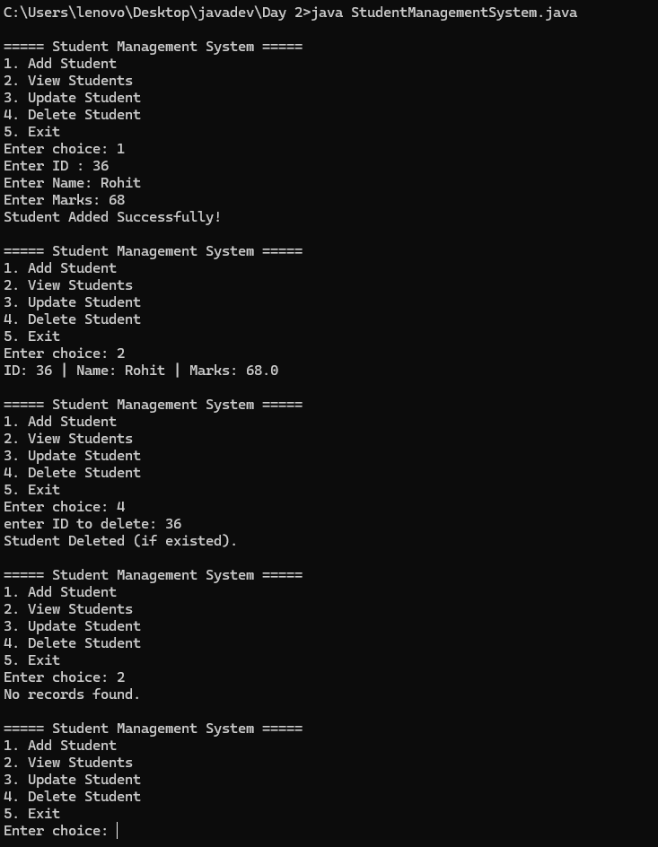

# Student Management System

A simple console-based Student Management System built in Java.

## Overview

This project is a basic CLI application that allows users to manage student records. It supports CRUD (Create, Read, Update, Delete) operations using an in-memory `ArrayList` and console input/output via `Scanner`.



## Features

- **Add Student**: Add a new student with ID, name, and marks.
- **View Students**: Display all stored student records.
- **Update Student**: Update a student's name and marks by ID.
- **Delete Student**: Remove a student record by ID.
- **Exit**: Gracefully exit the application.

## Project Structure

```
Day 2/
├── Student.java                  # Student model class
├── Student.class                 # Compiled Student class
├── StudentManagementSystem.java  # Main application with CRUD operations
├── StudentManagementSystem.class # Compiled main class
└── task 2 (1).pdf                # Original task document
```

## Classes

### `Student`

Represents a student entity with the following attributes:

- `id` (int): Unique identifier
- `name` (String): Student's name
- `marks` (double): Student's marks

Includes getters, setters, and a `display()` method to print student details.

### `StudentManagementSystem`

The main application class containing:

- Interactive menu-driven CLI
- Static `ArrayList<Student>` for data storage
- Methods for add, view, update, and delete operations

## How to Run

### Prerequisites

- Java Development Kit (JDK) 8 or higher

### Compile

```bash
javac Student.java StudentManagementSystem.java
```

### Run

```bash
java StudentManagementSystem
```

## Usage Example

```
===== Student Management System =====
1. Add Student
2. View Students
3. Update Student
4. Delete Student
5. Exit
Enter choice: 1
Enter ID : 101
Enter Name: John Doe
Enter Marks: 85.5
Student Added Successfully!
```

## Notes

- Data is stored in-memory and will be lost when the program terminates.
- No duplicate ID validation is implemented.
- Designed for learning purposes; not production-ready.
